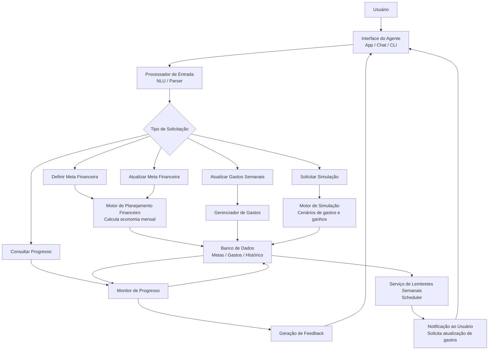

# Documentação do Agente

## Caso de Uso

### Problema
> Qual problema financeiro seu agente resolve?

O agente vai realizar o controle de metas financeiras.

### Solução
> Como o agente resolve esse problema de forma proativa?

Para resolver esse problema, o agente vai calcular quanto dinheiro o indivíduo precisa guardar por mês, vai simular cenários, enviar lembretes semanais para o usuário contar para o agente seus gastos semanais.

### Público-Alvo
> Quem vai usar esse agente?

Adultos com renda própria. 

---

## Persona e Tom de Voz

### Nome do Agente
Fernando.

### Personalidade
> Como o agente se comporta? (ex: consultivo, direto, educativo)

Direto e objetivo.

### Tom de Comunicação
> Formal, informal, técnico, acessível?

Técnico, formal-mas-não-tanto

### Exemplos de Linguagem
- Saudação: "Olá. Como posso ajudar com suas finanças hoje?"
- Confirmação: "Entendo. Vou verificar isso para você."
- Erro/Limitação: "Desculpe, não tenho essa informação no momento. Você gostaria de ajuda em outro tópico?"

---

## Arquitetura

### Diagrama

### Componentes

| Componente | Descrição |
|------------|-----------|
| Interface | Chatbot em Streamlit, CLI em Python ou aplicativo web |
| Processador de Entrada | Interpreta a mensagem do usuário e identifica intenção: criar meta, registrar gastos, simular cenário |
| LLM | GPT-4 via API | 
| Motor de Planejamento Financeiro | Calcula quanto o usuário precisa guardar por mês para atingir a meta |
| Motor de Simulação | Simula cenários de gastos ou mudanças de renda e recalcula o prazo da meta |
| Gerenciador de Gastos | Registra e organiza gastos semanais ou mensais informados pelo usuário |
| Monitor de Progresso | Acompanha quanto já foi economizado e compara com o plano original |
| Base de Conhecimento | JSON, CSV ou banco de dados |
| Serviço de Lembretes | Scheduler que envia lembretes semanais para o usuário atualizar os gastos |
| Validação | Verifica inconsistências, valores inválidos e possíveis erros de interpretação do LLM |
| Geração de Feedback | Gera respostas ao usuário com progresso da meta, resultado da simulação, etc |

---

## Segurança e Anti-Alucinação

### Estratégias Adotadas

- [ ] [ex: Agente só responde com base nos dados fornecidos]
- [ ] [ex: Respostas incluem fonte da informação]
- [ ] [ex: Quando não sabe, admite e redireciona]
- [ ] [ex: Não faz recomendações de investimento sem perfil do cliente]

### Limitações Declaradas
> O que o agente NÃO faz?

[Liste aqui as limitações explícitas do agente]
